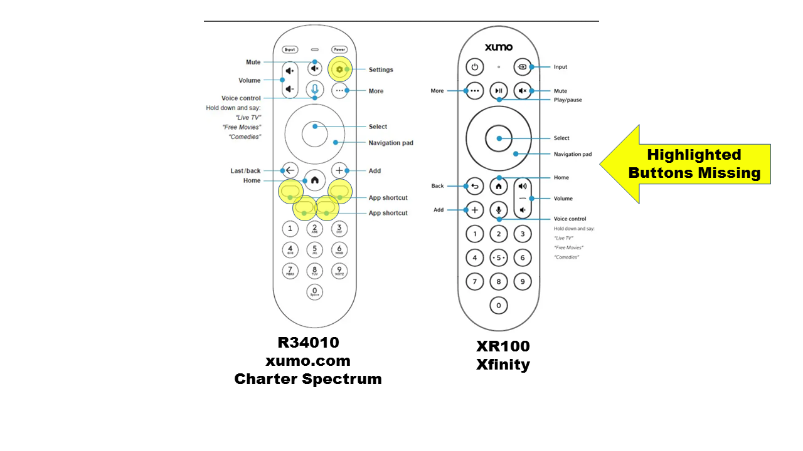

# Xumo Stream Box Remote Codes

This repo contains codes and protocol information for the two remotes for the Xumo Stream Box.

## Know which remote you have before you begin!

## Guide to the Folders
|Folder|Contents|
|------|--------|
|**GIRR For Harmony (use Xumo SCXI11BEI template)**|These GIRR files are designed to be used with [my fork of MHGUI](https://github.com/Ben-Meister/congruity) to overwrite the Xumo SCXI11BEI device from the Logitech Database, with the correct codes for your remote. These files alias certain functions multiple times in order to completely populate the Harmony template, including aliasing button codes that are not present on the physical remote to buttons that are.|
|**Images**|The image for this Readme.|
|**JP1**|JP1 RMDUs that you can load into your JP1 remote using RemoteMaster to emulate either XUMO remote.|
|**PDF**|A description of the remote protocol (XMP), plus individual Pronto codes for the buttons on the R34010 remote.|
|**Plain GIRR**|These GIRR files just contain the individual Pronto codes for the remotes and are not designed for use with the Harmony template.|